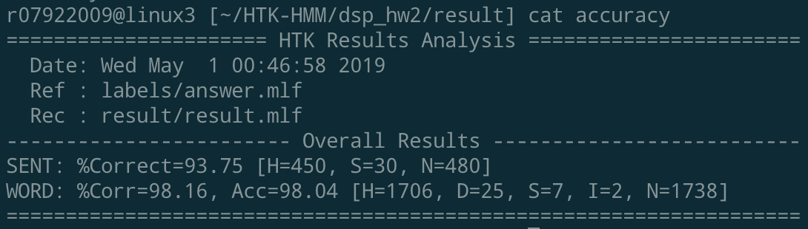

# HTK-HMM

implement a monophone recognizer with HTK

the model is based on this [data & default model](http://speech.ee.ntu.edu.tw/homework/DSP_HW2-1/dsp_hw2-1.zip)

## 最佳結果

最佳結果是以 10 個 Gaussian Mixture model，16 個 states 的 HMM，以及前兩個循環 10 次，最後一個循環 20次的 training iterations 跑出的



## 執行環境

執行環境為 NTU CSIE 的工作站，詳細的環境如下:
```sh
OS: 5.0.7-arch1-1-ARCH
gcc: gcc version 8.3.0
```

## 相關程式修改

- `lib/mix2_10.hed`: 增加 GMM 的數量至 10
- `lib/proto`: 增加 HMM 的狀態數至 16
- `03_training.sh`: 增加訓練次數至每個循環 10 次，最後一次循環 20 次
- `04_testing.sh`: 修改讓其會寫入一檔案 `total_result`，讓他保留之前的 result 紀錄而不致在執行`00_clean_all.sh`後遺失紀錄

## 訓練策略

### 1. 增加訓練次數

從初始的 3 次開始，嘗試過10、20、30、40、50次、頭兩個循環進行 10 次調整，最後一個進行 20 次調整、頭兩次循環進行 50 次調整，最後一個循環進行 100 次調整

最後發現頭兩個循環的訓練次數 10 次的表現最好，但在做其他實驗時發現 10-20 的表現會更好，所以之後使用 10-20 的訓練次數策略

### 2. 增加 Guassian Mixture 的個數

對 liN~jiou 增加他們的 GMM 個數，因為我判斷 silence model 的預設 GMM 個數 (3) 已足夠

從初始的 3 個 GMM 開始，嘗試過 4 ~ 12 的數量，發現 10 個 GMM 的表現會最好

### 3. 增加 HMM 中的狀態數

增加 HMM 的 state 數量代表為音素分類出更多的前後文關係

從初始的 5 個 state 開始，嘗試 6 ~ 18 個 state，訓練效果以 16 個 state 為最好

## 發現

- 一開始固定 GMM 和 HMM 的 state 數目，發現單純以 10 次 iteration 的表現最好，不過在嘗試不同 HMM state 數後發現 10-20 的 iteration 訓練策略表現會更好 (96.26 -> 97.18)

- 另外也發現如果以 default 的參數下，將 HMM state 增加至 17 個以上，HTK 會跳出警示訊息


## 相關實驗結果

- 將 GMM 的數量固定在 3，HMM 的 state 數固定在 5

|iterations| 3-5 (default)  | 10  | 20  | 30  | 40  | 50  | 50-100  | 10-20  |
|:-:|---|---|---|---|---|---|---|---|
| Acc  | 74.34 | 77.96  | 75.83  | 77.10  | 77.22  |  77.22 |  77.04 |  75.89  |

- 將訓練次數固定在 10 次，GMM 的數量固定在 3

|HMM states| 5 (default)  | 6  | 7  | 8  | 9  | 10  | 11  | 12  | 13|14|15|16|17| 18|
|:-:|---|---|---|---|---|---|---|---|---|---|---|---|---|---|
| Acc  | 77.96 | 82.74  | 88.95| 91.48| 92.23  |  94.02 |  95.17 |  95.74  |96.43|96.49|96.49|96.72|96.78 (with bad data or over pruning warning)| 96.26 (with bad data or over pruning warning)|

- 將訓練次數固定在 10-20 次，GMM 的數量固定在 3

|HMM states| 5 (default)  | 16  | 17  |
|:-:|---|---|---|
| Acc  | 75.89 |97.18| 97.24((with bad data or over pruning warning))|

- 將訓練次數固定在 10-20 次，HMM 的 state 數固定在 16

|GMMs| 3 (default)  | 4  | 5  | 6  | 7  | 8  | 9  | 10 | 11|12|
|:-:|---|---|---|---|---|---|---|---|---|---|---|
| Acc  | 97.18 |97.70| 97.87| 97.87| 97.99| 97.81  |  97.76 |  98.04 |  97.99  |97.70|

## Author

kuoteng, Ding
